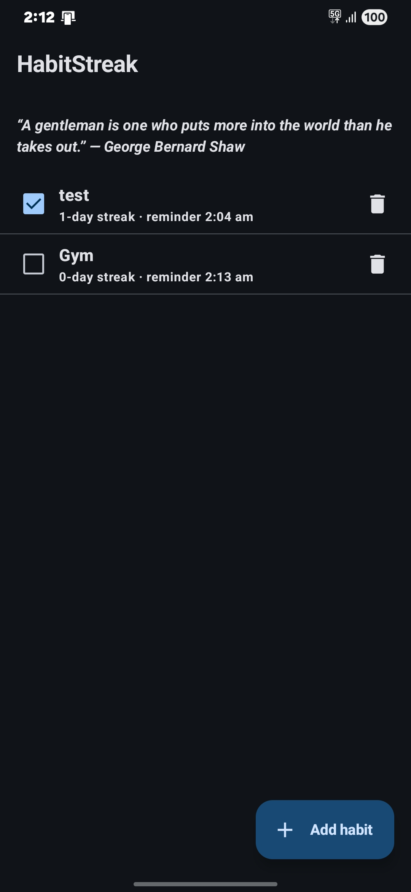
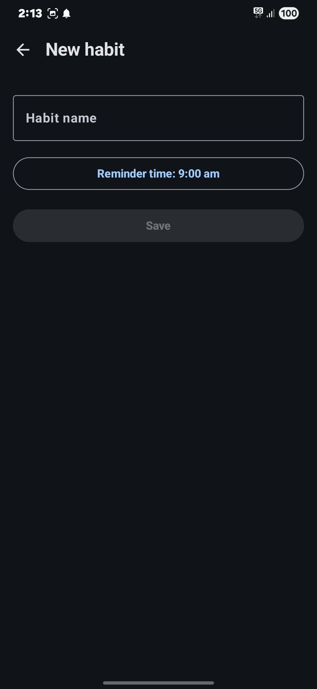
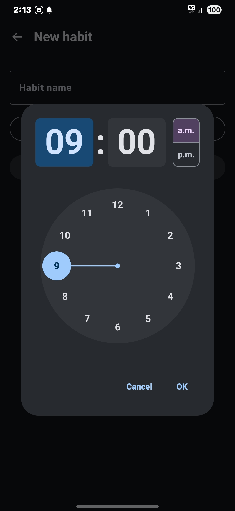
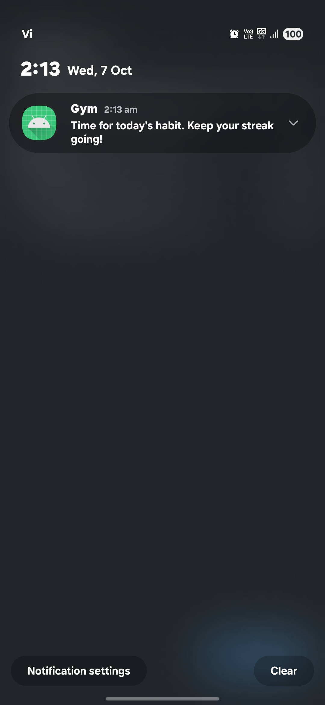

# HabitStreak

A small native Android app for building daily habits. Add a habit, tick it off each day, watch the streak grow, and get a reminder notification at a time you choose. The home screen also shows a motivational quote of the day.

## Download

[**Download the latest APK**](https://github.com/NachiketAbhayVaidya/HabbitStreak/releases/latest) from the GitHub Releases page (debug build, Android 8.0 or newer). Open the file on your phone and allow "Install unknown apps" if Android asks. A [Google Drive mirror](https://drive.google.com/file/d/1YuFfoZGejmgrWUCqMV3gOWV1nW0hqpFt/view?usp=sharing) is also available. To build it yourself, see [Build an APK](#build-an-apk).

## Screenshots

| Home | New habit | Reminder time | Reminder notification |
|:---:|:---:|:---:|:---:|
|  |  |  |  |

## Features

- **Habits:** add, edit and delete habits (delete asks for confirmation).
- **Daily check-off:** tick a habit as done for today; untick to undo.
- **Streaks:** the current streak is shown per habit. Today counts if it is done; if today isn't done yet the streak continues from yesterday; a missed day resets it to 0.
- **Reminders:** one daily notification per habit at the time you pick. It is skipped if the habit is already done today. Reminders survive a reboot.
- **Quote of the day:** fetched from [zenquotes.io](https://zenquotes.io/api/today) and cached, so it still shows offline.
- **Empty, loading and error states** are handled, and the app survives rotation.

## Tech stack

Only what the app actually uses:

| Area | Library |
|---|---|
| Language | Kotlin 2.0.21 |
| UI | Jetpack Compose with Material 3 (Compose BOM 2024.09.00), single Activity |
| Navigation | Navigation Compose 2.7.7 |
| Architecture | MVVM: `ViewModel` + `StateFlow` + Repository |
| Database | Room 2.6.1 with KSP (not kapt) |
| Networking | Retrofit 2.11.0 + Gson converter |
| Background work | WorkManager 2.9.1 |
| Dependency injection | Hilt 2.52 (with `hilt-navigation-compose` and `hilt-work`) |
| Tests | JUnit 4 |

Build setup: Android Gradle Plugin 8.9.0, Gradle 8.11.1, `minSdk` 26, `compileSdk`/`targetSdk` 35.

## Architecture

```
UI (Compose screens)  ->  ViewModel (StateFlow)  ->  Repository  ->  Room / Retrofit
        ^                                                                  |
        +------------------------ state flows back up --------------------+
```

State flows down to the screens as immutable state, and events flow up as function calls (one-way data flow). The screens hold no business logic.

```
app/src/main/java/com/example/habitstreak/
  ui/       Compose screens, ViewModels, navigation, theme
  data/     Room entities + DAOs, repositories, Retrofit API, reminder worker and scheduler
  domain/   Pure Kotlin logic with no Android dependencies: streak calculation, reminder delay
  di/       Hilt module that provides the database, Retrofit service and WorkManager
```

Key decisions:

- **Streak logic is a pure function** (`calculateStreak(dates, today)`). `today` is passed in instead of read from the clock, which makes the midnight edge cases easy to unit test.
- **The quote is cached in Room and the UI only reads the cache.** A successful fetch updates the cache and the screen updates by itself. At most one request is made per day.
- **WorkManager instead of exact alarms** for reminders: it survives reboots and needs no special permission, at the cost of Android possibly delaying a reminder by a few minutes to save battery.
- **Dates are stored as epoch days** (`LocalDate`) through a Room type converter, so a stored date never shifts with the time zone.
- **Room migration** (`MIGRATION_1_2`) adds the quote table without wiping the user's habits.

## Build and run

Requirements: Android Studio (recent version) with the Android SDK for API 35, and a phone or emulator running Android 8.0 (API 26) or newer.

1. Clone the repository:
   ```
   git clone https://github.com/NachiketAbhayVaidya/HabbitStreak.git
   ```
2. Open the folder in Android Studio and let Gradle sync.
3. Pick a device (an emulator, or a phone with USB debugging turned on) and press **Run**.

From the command line instead:

```
./gradlew assembleDebug        # on Windows: .\gradlew.bat assembleDebug
```

### Build an APK

**Debug APK** (signed automatically with a debug key, installs directly):

```
./gradlew assembleDebug
```

The file is created at `app/build/outputs/apk/debug/app-debug.apk`. Copy it to a phone and open it, or install it over USB:

```
adb install -r app/build/outputs/apk/debug/app-debug.apk
```

**Release APK:** a release build must be signed with your own key, otherwise Android refuses to install it. In Android Studio use **Build > Generate Signed App Bundle / APK**, choose **APK**, create or select a keystore, and pick the `release` build type. Keep the keystore file and its passwords out of git.

## Run the tests

```
./gradlew testDebugUnitTest    # on Windows: .\gradlew.bat testDebugUnitTest
```

The 15 unit tests cover the streak calculation (empty list, only today, today missing but yesterday done, gaps, duplicate dates, unsorted input, the midnight boundary, month and year rollover) and the reminder delay calculation.

## Try the reminders on a real phone

1. Add a habit and set its reminder time 2 to 3 minutes from now. Allow notifications when asked (Android 13+).
2. Lock the phone and wait. The notification should arrive within a few minutes of that time.
3. Add a second habit, tick it as done before its reminder time, and confirm no notification arrives.
4. Restart the phone before the time passes to check the reminder survives a reboot.

If nothing arrives, check that battery optimisation isn't restricting the app. To watch what the worker does, filter Logcat by the tag `ReminderWorker`.

## What I learned

- How to structure a small app with MVVM and one-way data flow, and why a sealed `UiState` forces every screen to handle loading, error and empty cases.
- Why pure functions are easier to test: passing `today` into the streak function turned time-dependent edge cases into plain unit tests.
- Room in practice: type converters for `java.time`, composite primary keys and foreign keys with cascade delete, `Flow` queries that update the UI, and writing a migration instead of wiping data.
- Offline-first caching: the screen reads only from the database, and the network just refreshes it.
- WorkManager: periodic work, unique work names, how its jobs persist across reboots, and why timing is approximate. Also the Android 8+ notification channels and the Android 13+ notification permission.
- Hilt: what `@Inject` constructors, `@Module`/`@Provides`, `@HiltViewModel` and `@HiltWorker` each solve, and why WorkManager needed its default initializer turned off.
